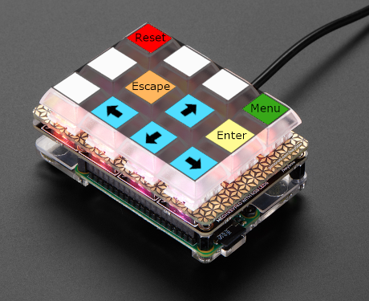

# Keybow for MiSTeR

This is my personal setup for using a Keybow mini mechanical keyboard to control the On Screen Display of my MiSTeR. Though the MiSTeR can just as easily be operated with any usb keyboard, I found the small form factor and macro functionality to be especially convenient for my needs.

## Purchase

I purchased my Keybow Kit from here: https://shop.pimoroni.com/products/keybow?variant=21246333419603

Any micro SD card will work for the OS.

## Layout



* Reset: presses the key combo for resetting the MiSTer
* F12: bring up the OSD menu
* Escape: exit menus
* Enter: confirm a choice in the menu
* Arrow keys: navigation

## Setup

Follow the official documentation to assemble your Keybow and setup the OS on your micro SD card.

[Assembling your Keybow](https://learn.pimoroni.com/article/assembling-keybow)

[Setting up the Keybow OS](https://learn.pimoroni.com/article/setting-up-the-keybow-os)

After that is done, mount the micro SD card on your computer. You may need to edit the `deploy.sh` script in this repo so that it points at the path to your micro SD card. Once done, run the script to copy the lua scripts over.

```
> ./deploy.sh
DONE. deployed to /Volumes/KEYBOW12/
```

Then, enjoy!